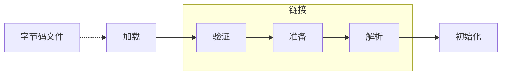
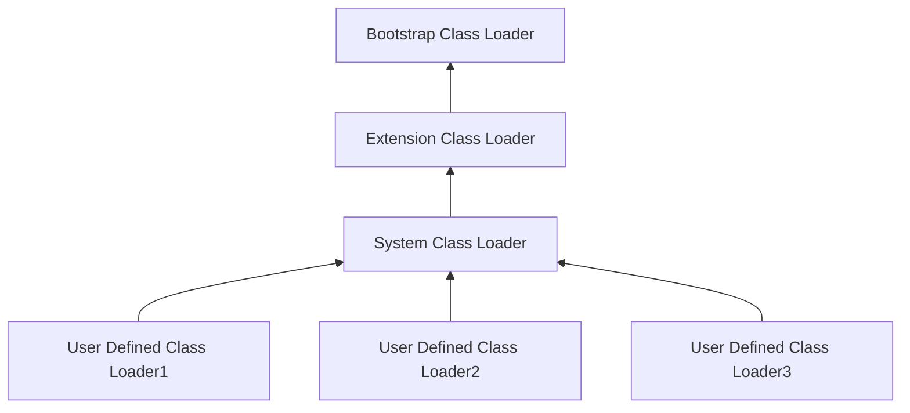
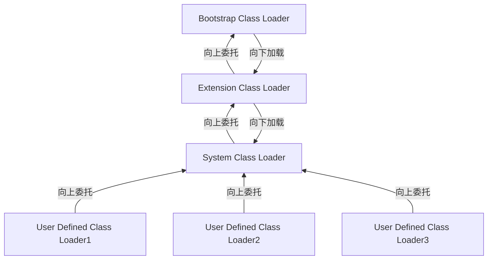

### JVM

1. jvm不仅仅能解释运行java程序，只要是编译后的字节码文件遵循jvm规范的语言都能被jvm执行。

多语言混合编程

JVM正在从**Java语言的虚拟机**向**多语言虚拟机**的方向发展，不同语言解决自己擅长的领域，最后全部使用JVM解释执行。

JVM种类

- HotSpot

- JRockit

- IBM的J9

- Graal VM

  > **未来有可能会替代HotSpot虚拟机**

- 前端编译器
- JIT后端编译器
  - 将热点代码的字节码编译为机器指令，并缓存起来，提升执行性能
- 解释器
  - 逐行解释执行，保证程序的响应时间

#### JVM的架构模型

> JVM采用的是基于栈的指令集架构，另外一种架构是基于寄存器的指令集架构

- 基于栈式的架构特点
  - 设计和实现更简单，适用于资源受限的系统
  - 避开了寄存器的分配难题，使用**零地址**指令方式分配
  - 指令流中的指令大部分是零地址指令（每8位字节对齐），其执行过程依赖于操作栈。指令集更小，编译器容易实现
  - 不需要硬件支持，可移植性更好，更好实现跨平台

- 基于寄存器架构的特点
  - 指令集架构则完全依赖硬件，可移植性差
  - 16位双字节的方式对齐
  - 性能优秀和执行更高效
  - 花费更少的指令去完成操作
  - 指令集往往是一地址指令、二地址指令和三地址指令为主

==由于跨平台性的设计，Java的指令都是根据栈来设计的。==不同平台CPU架构不同，所以不能设计为基于寄存器的。

#### JVM的生命周期

- 虚拟机的启动

  > Java虚拟机的启动是通过引导类加载器（bootstrap class loader）创建一个初始类来完成的，这个类是由虚拟机的具体实现指定的。

- 虚拟机的执行

  > 执行一个所谓的Java程序的时候，真正执行的是一个叫做Java虚拟机的进程。

- 虚拟机的退出

  > 1. 正常退出
  > 2. 异常退出

#### 类加载器子系统

> - ClassLoader只负责class文件的加载，至于它是否可以运行，则由执行引擎Execution Engine决定。
> - 加载的类信息存放于一块称为==方法区==的内存空间。除了类的信息外，方法区中还会存放运行时常量池，可能还包括字符串字面量和数字常量（这部分常量信息是Class文件中常量池部分的内存映射），即将磁盘上的class文件加载到内存中，生成对应的运行时数据。
> - class文件通过二进制流的方式加载到JVM中，被称为DNA元数据模板，放在方法区。

- 加载 Loading

  > 1. 通过一个类的全限定名获取定义此类的二进制流
  > 2. 将这个字节流所代表的静态存储结构转化为方法区的运行时数据结构
  > 3. 在内存中生成一个代表这个类的java.lang.Class对象，作为方法区这个类的各种数据的访问入口

- 链接
  - 验证 Verify：验证class文件的合法性
  - 准备 Prepare
    - 为类变量初始化零值（int就是0，boolean就是FALSE...）
    - final修饰的static的常量在编译的时候就会隐式初始化了，在准备阶段会显示初始化为具体的值
    - 这里不会为实例变量分配初始化，类变量会分配在方法区中，而实例变量会随着对象一起分配到Java堆中
  - 解析 Resolve
    - 将常量池内的符号引用转换为直接引用的过程
    - 通常情况下解析动作都是在初始化之后完成的
- 初始化
  - 初始化阶段就是执行类构造器方法`<clinit>()`的过程
  - 此方法不需要定义，是javac编译器自动收集类中的所有**类变量的赋值动作**和**静态代码块中的语句**合并而来
  - 构造器方法中指令按语句在源文件中出现的**顺序执行**
  - `<clinit>()`不同于类的构造器（类构造器在字节码中对应`<init>()`）。它是虚拟机视角下的`<init>()`
  - 若存在父类，JVM保证父类的clinit先执行完
  - 虚拟机保证clinit在多线程下被同步加锁

#### 类加载器

这里的的四者之间的关系是包含。不是上下层也不是继承关系

- 引导类加载器
  - 使用C/C++语言实现，嵌套在JVM内部
  - **只**用来加载Java的核心类库，加载包名为java、javax、sun等开头的类
  - 并不继承java.lang.ClassLoader，没有父加载器
  - 负责加载扩展类和系统类加载器，并指定为他们的父加载器
- 扩展类加载器（Extension ClassLoader）
  - java语言编写，继承于ClassLoader类
  - 主要加载jre/lib/ext子目录下的类库，**如果用户创建的jar放在此目录，也会由扩展类加载器加载**
- 系统类加载器（APPClassLoader）
  - **是自定义类的默认类加载器**
- 自定义类加载器
  - 为什么需要自定义加载器？
    - 隔离加载类
    - 修改类加载的方式
    - 扩展加载源
    - 防止源码泄露
  - 如何自定义类加载器
    - 继承抽象类java.lang.ClassLoader并重写findClass()
    - **如果没有过于复杂的需求，可以直接继承URLClassLoader类**，这样就不用去编写findClass方法了

#### 双亲委派机制

> Java虚拟机对class文件采用的是按需加载的方式，也就是说当需要使用该类时才会将它的class文件加载到内存生成class对象。而且加载某个类的class文件时，Java虚拟机采用的是双亲委派机制，即把请求交由父类处理，它是一种任务委派模式。

**工作原理**

> 如果一个类的加载器收到了类加载请求，它并不会立即去加载，而是一直向上委托，一直到系统类加载器，如果属于系统类加载器管辖的范畴，则系统类来加载，如果不是，则会继续向下委托，直到找到合适的类加载器为止

**好处**

- 避免类的重复加载
- 防止核心API被随意篡改

在JVM中表示两个class对象是否为同一个类存在两个必要条件：

- 类的完整类名必须一直，包括包名
- 加载这个类的ClassLoader必须相同

JVM必须知道一个类是由启动类加载器加载的还是由用户类加载器加载的。==如果一个类型是由用户类加载器加载的，那么JVM会将这个类加载器的一个引用作为类型信息的一部分保存在方法区中。==当解析一个类型到另一个类型的引用的时候，JVM需要保证这两个类型的类加载器是相同的。

#### 类的主动使用和被动使用

#### 字节码

虚拟机在加载Class文件时才会进行动态链接，也就是说，Class文件中不会保存各个方法和字段的最终内存布局信息，因此，这些字段和方法的符号引用不经过转换是无法直接被虚拟机使用的。==当虚拟机运行时，需要从常量池中获得对应的符号引用，再在类加载过程中的解析阶段将其替换为直接引用，并翻译到具体的内存地址中。==

- 符号引用：符号引用以一组符号来描述所引用的目标，符号引用与虚拟机实现的内存布局无关，引用的目标并不一定已经加载到了内存中
- 直接引用：直接引用可以是直接指向目标的指针、相对偏移量或是一个能间接定位到目标的句柄。直接引用与虚拟机实现的内存布局相关，同一个符号引用在不同虚拟机实例上翻译出来的直接引用一般不会相同。如果有了直接引用，那说明引用的目标必定已经存在于内存之中了。

### 运行时数据区

#### PC计数器

> Program Counter Register，寄存器存储指令相关的现场信息。CPU只有把数据装载到寄存器才能够运行。
>
> **PC寄存器用于存储指向下一条指令的地址**，即即将要执行的指令代码。由执行引擎读取下一条指令。
>
> 它是一块很小的内存空间，几乎可以忽略不计，也是运行速度最快的存储区域。
>
> 每个线程都有自己的程序计数器，是**线程私有的**，生命周期与线程的生命周期保持一致
>
> 它是唯一一个不存在OOM的区域。

面试题：

1. 为什么使用PC寄存器记录当前线程的执行地址呢？

   > 因为CPU需要不停的切换各个线程，这时候切换回来以后，就得知道接着从哪里开始继续执行

2. PC寄存器为什么是线程私有的？

   > 为了能够准确地记录各个线程正在执行的当前字节码指令地址，最好的办法就是为每一个线程都分配一个PC寄存器。

#### 虚拟机栈 Stack

==栈式运行时的单位，而堆是存储的单位。==

每个线程在创建的过程中都会创建一个虚拟机栈，其内部保存着一个一个的栈帧（Stack Frame），每个栈帧对应着一个方法，线程私有的，生命周期与线程一致。栈是一种快速有效的分配存储地址，访问速度仅次于程序计数器。只有入栈和出栈操作。主管程序运行，它保存方法的局部变量（8种基本数据类型和对象的引用地址）和部分结果，并参与方法的调用与返回。局部变量 VS 成员变量（属性）基本类型变量 VS 引用类型变量（类/数组/接口）栈不存在GC，存在StackOverFlow，当系统内存满了会出现OOM。-Xss 设置栈的大小

Java方法有两种返回函数的形式，一种是正常的函数返回，使用return指令；另外一种是抛出异常，不管哪种方式都会导致栈帧被弹出。LV Local Variables 局部变量表主要存储方法参数和定义在方法体内的局部变量，这些数据类型包括8种基本数据类型，对象引用（reference），以及returnAddress类型局部变量表存储结构是一个存储数字的数组，所以大小在编译期就确定下来了局部变量表中的变量只在当前方法调用中有效。当方法调用结束后，随着方法栈帧的销毁而销毁。存储在栈上，不存在线程安全的问题Slot（槽）是局部变量表最基本的存储单元，32位占一个槽（int byte 引用类型等），64位占两个槽（long double）非静态方法的局部变量表的第0位存储的是thisOS Operand Stack 操作数栈操作数栈指的是在方法执行过程中，根据字节码指令向栈中写入数据或提取数据，即入栈Push/出栈Pop**主要存放计算过程中的中间结果，作为计算过程中的临时存储空间**。比如push操作就是将数据压入到操作数栈，然后通过store操作将操作数栈中的数据存储到局部变量表中，load操作就是把局部变量表的值加载到操作数栈中用于计算使用数组结构实现，但是只能通过入栈出栈的方式来访问数据，不能直接通过索引访问数据操作数栈栈的深度在编译期就确定好了如果被调用的方法存在返回值，其返回值也会压入到当前栈帧的操作数栈中，并更新PC寄存器下一条需要执行的字节码指令偏移量。JVM的解释引擎是基于栈的执行引擎，其中的栈指的是操作数栈。DL Dynamic Linking 动态链接 指向运行时常量池的方法引用RA Return Address 方法返回地址  当某方法执行结束后会出栈，出栈的同时将PC存放寄存器的值存放到方法返回地址中一些附加信息
栈空间不存在GC，当栈空间是固定值时，栈内存用完后会出现内存溢出，会报异常StackOverFlow；当栈的空间是可扩展的情况，所有内存被用光后会出现OutofMemery；

##### 方法的调用

- 静态链接

  当一个字节码文件被装载进JVM内部时，如果**被调用的目标方法在编译期可知，且运行期保持不变**。这种情况下将调用方法的符号引用转换为直接引用的过程称之为静态链接。

- 动态链接

  如果被调用的方法在编译期无法确定下来，称之为动态链接

绑定是一个字段、方法或者类的符号引用被替换为直接引用的过程，这**仅仅发生一次**。分为早起绑定（对应静态链接）和晚期绑定（对应动态链接）

##### JVM中的线程种类

- 虚拟机线程
- 周期任务线程
- GC线程
- 编译线程：这种线程会在运行时会将字节码编译成本地代码
- 信号调度线程
