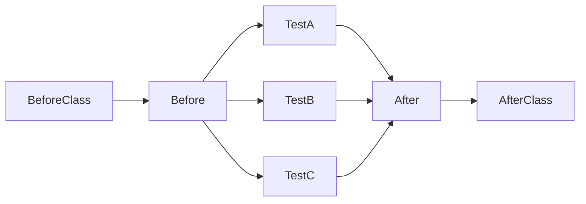

### JUnit4

#### Junit执行测试的生命周期

> @Before用于初始化测试对象，测试对象以实例变量存放
>
> @After用于清理@Before创建的对象
>
> @BeforeClass用于初始化耗时资源，以静态变量存放
>
> @AfterClass用于清理@BeforeClass创建的资源

#### 异常测试

> 测试异常可以使用@Test(expected = Exception.class)
>
> 对可能发生的每种类型的异常进行测试

#### 参数化测试

> 1. 参数必须由静态方法data()返回，返回类型为Collection<Object[]>，静态方法必须标记为@Parameters
> 2. 测试类必须标记为@RunWith(Parameterized.class)
> 3. 构造方法参数必须和测试参数对应

#### 超时测试

> @Test(timeout = 500)，单位为毫秒
>
> ==超时测试并不能取代性能测试和压力测试==