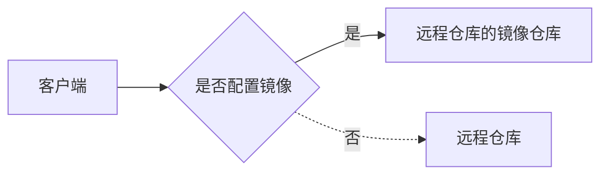

### Maven

#### settings.xml文件位置

settings.xml文件一般存在于两个位置：
全局配置: ${M2_HOME}/conf/settings.xml
用户配置: user.home/.m2/settings.xmlnote：用户配置优先于全局配置。

#### 配置优先级

需要注意的是：**局部配置优先于全局配置**。
配置优先级从高到低：pom.xml> user settings > global settings
如果这些文件同时存在，在应用配置时，会合并它们的内容，如果有重复的配置，优先级高的配置会覆盖优先级低的。

#### 镜像与仓库

##### 镜像与仓库的区别？

> 镜像相当于一个拦截器，mirror表示的是两个Repository之间的镜像关系
>
> `<mirrorOf></mirrorOf>`标签里面放置的是要被镜像的Repository ID

#### remote.repositories和lastUpdated

>_remote.repositories可以理解为该jar包的来源明细
>
>lastUpdated可以理解为错误文件
>
>假设我们更换了私服地址为nexus-abc,并且**该私服不存在该资源**,那么就会**生成**logback-parent-1.1.1.pom**.lastUpdated**文件;
>也就是说,_remote.repositories文件，标示该资源的来源，如果你有这个_remote.repositories，**那就会在访问本地的同时，必须确保远程上有才行**(这里的远程是setting文件中配置的镜像或远程仓库,用id来进行关联)，否则就会报错;

